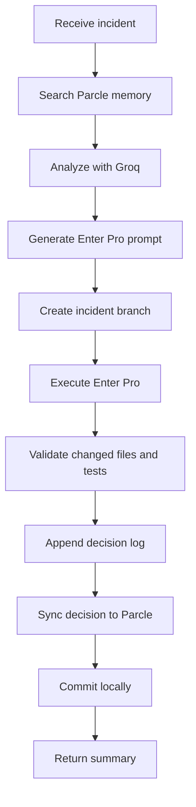

# AI Incident Resolution Agent

A FastAPI and LangGraph service that turns a production incident into a documented, tested, locally committed
remediation in an existing Employee Portal repository. It searches Parcle memory, uses Groq for evidence-based
analysis and implementation planning, delegates the edit to Enter Pro, validates the result, and records an audit trail.

The workflow intentionally **does not push**. A human reviews the local incident branch and pushes it later.

## Workflow



Each node is small and dependency-injected. External systems live under `app/integrations`, Pydantic boundary
models under `app/models`, prompt policy under `app/prompts`, and the extensible graph state under `app/graph`.

## Configuration

Copy `.env.example` to `.env` and provide the real Parcle, Groq, Enter Pro, and Employee Portal values. Important:

- `EMPLOYEE_PORTAL_PATH` must point to an existing local Git repository.
- `VALIDATION_COMMAND` is run inside that repository after Enter Pro edits it.
- `ENABLE_GIT_PUSH` defaults to `false` and is retained as an explicit safety setting; this workflow never invokes push.
- The Parcle adapter posts the query, result limit, and namespace to `PARCLE_BASE_URL + PARCLE_SEARCH_PATH`.
- Parcle writes are posted to `PARCLE_BASE_URL + PARCLE_UPSERT_PATH` under `PARCLE_NAMESPACE`.
- The Enter Pro adapter posts `{"prompt": "...", "project_path": "..."}` to `ENTERPRO_URL`.

If your existing Parcle or Enter Pro contract differs, only its adapter needs to change.

## Seed Parcle memory

The Employee Portal root must contain exactly these canonical context files:

- `API_DOCUMENTATION.md`
- `PARCLE_MEMORY.md`
- `README.md`

Validate them without writing anything:

```bash
python -m scripts.ingest_parcle --dry-run
```

Then perform the one-time idempotent upsert:

```bash
python -m scripts.ingest_parcle
```

Use `--project-path C:/path/to/employee-portal` to override `EMPLOYEE_PORTAL_PATH`. Stable document IDs such as
`employee-portal:api_documentation.md` mean rerunning the command updates those records instead of creating duplicates.
The service sends complete Markdown documents; Parcle may apply its own internal chunking/indexing.

### Where memory is updated

The searchable memory is not stored in this agent repository. It is updated in the remote Parcle service at:

```text
PARCLE_BASE_URL + PARCLE_UPSERT_PATH
namespace: PARCLE_NAMESPACE
```

With `.env.example`, that is `https://parcle.example/api/documents/upsert`, namespace `employee-portal`.
Replace the example URL with your real Parcle endpoint. Separately, the human-readable local audit trail is stored at
`<EMPLOYEE_PORTAL_PATH>/docs/agent_decisions.md`. After every successful incident, that decision is both appended to
the local audit file and upserted into the configured Parcle namespace so later searches can use it.

## Run locally

```bash
python -m venv .venv
# Activate the virtual environment, then:
pip install -r requirements.txt
uvicorn app.main:app --reload
```

Resolve an incident:

```bash
curl -X POST http://localhost:8000/api/v1/incidents/resolve \
  -H "Content-Type: application/json" \
  -d '{"incident":"Users cannot update their profile after the validation rollout"}'
```

The response contains `branch_name`, `files_modified`, `documentation_updated`, `commit_hash`, validation details,
and a summary. Failures from external integrations or validation return an error without pushing anything.

## Testing and visualization

```bash
pytest -q
python -m scripts.generate_graph
```

The visualization script writes `docs/incident_workflow.mmd`. Every successful target-repository run appends its
evidence and decisions to `docs/agent_decisions.md`, syncs the decision to Parcle, and then commits locally.

## Docker

Set `EMPLOYEE_PORTAL_PATH_HOST` to the host Employee Portal directory, then run `docker compose up --build`.
The target repository is mounted into the container at `/workspace/employee-portal`.
